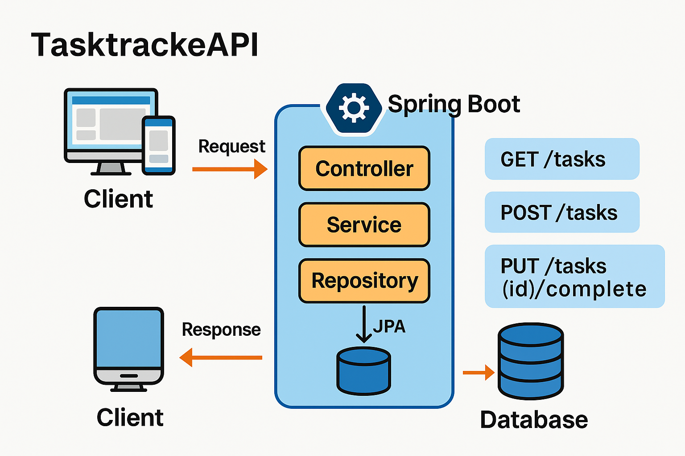

# 🚀 TasktrackeAPI

A REST API built with **Spring Boot** for managing tasks: creation, completion, and listing.



---

## 📘 Key Features

- ✅ **GET /tasks** – Returns all tasks
- 📝 **POST /tasks** – Creates a new task
- ☑️ **PUT /tasks/{id}/complete** – Marks a task as completed

---

## 🧩 Project Structure

```
tasktrackeAPI/
├── src/
│   ├── main/java/com/tasktracker/
│   │   ├── TaskTrackerApplication.java
│   │   ├── controller/TaskController.java
│   │   ├── service/TaskService + TaskServiceImpl
│   │   ├── repository/TaskRepository.java
│   │   ├── model/Task.java
│   │   └── dto/TaskCreateDto, TaskResponseDto
│   └── resources/application.properties
├── pom.xml
└── README.md
```

---

## ▶️ Getting Started

### Prerequisites

- Java 17
- Maven

### Setup

```bash
git clone https://github.com/mirko1987/tasktrackeAPI.git
cd tasktrackeAPI
mvn clean install
mvn spring-boot:run
```

The API will be available at: `http://localhost:8080/tasks`

---

## 📊 API Examples

### ➕ Create a Task

```http
POST /tasks
Content-Type: application/json

{
  "title": "Study Spring Boot",
  "description": "Follow the official guide",
  "dueDate": "2025-07-01"
}
```

### ✅ Complete a Task

```http
PUT /tasks/1/complete
```

### 📄 Get All Tasks

```http
GET /tasks
```

---

## 🧪 Testing

Run all tests with:

```bash
mvn test
```

---